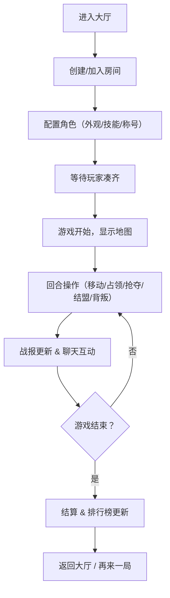

## 1. 产品概述

一款面向远程团队午休时快速开局的多人对战 Web 游戏，玩家通过占领格子领地、抢夺资源、合纵连横来争夺地图控制权，单局时长控制在 5-10 分钟。

- 核心用户：远程办公团队成员，寻求轻量级社交互动和团队破冰
- 产品价值：提供低门槛、高趣味性的多人即时对战，促进团队凝聚力

## 2. 核心功能

### 2.1 用户角色

| 角色 | 注册方式 | 核心权限 |
|------|----------|----------|
| 玩家 | 昵称+头像快速进入 | 创建/加入房间、游戏对战、查看排行榜 |
| 房主 | 创建房间后自动获得 | 调整人数、邀请玩家、开始游戏、踢人 |

### 2.2 功能模块

1. **大厅页**：房间列表、创建房间、邀请好友、人数选择（2-6人）
2. **角色页**：棋子外观配置、技能选择、称号设置
3. **地图页**：格子领地展示、资源点标记、陷阱位置、玩家棋子
4. **回合页**：移动操作、占领格子、抢夺资源、结盟提议、背叛宣战
5. **聊天页**：表情系统、快捷战术短语、屏蔽玩家
6. **战报页**：关键操作回放、伤害统计、收益统计、回合日志
7. **排行榜页**：胜率排名、连胜排名、赛季积分、新手引导、断线重连入口

### 2.3 页面详情

| 页面名称 | 模块名称 | 功能描述 |
|----------|----------|----------|
| 大厅页 | 房间列表 | 展示在线房间，支持快速加入 |
| 大厅页 | 创建房间 | 自定义房间名、选择游戏人数（2-6人）、设置密码 |
| 大厅页 | 邀请好友 | 生成房间邀请链接/码，支持复制分享 |
| 大厅页 | 人数选择 | 滑块或数字选择器，限定 2-6 人 |
| 角色页 | 棋子外观 | 颜色、形状、头像组合配置 |
| 角色页 | 技能选择 | 3 选 1 或自定义技能组合（加速、护盾、掠夺等） |
| 角色页 | 称号设置 | 选择或解锁称号展示在名字旁 |
| 地图页 | 格子领地 | 6x6 至 8x8 网格，不同地形（普通、资源、陷阱、据点） |
| 地图页 | 资源点 | 随机分布，占领后每回合产出资源 |
| 地图页 | 陷阱 | 踩中损失资源或跳过一回合 |
| 回合页 | 移动 | 骰子点数决定移动格数，选择方向 |
| 回合页 | 占领 | 空格子可占领，敌方格子需消耗资源攻击 |
| 回合页 | 抢夺 | 对相邻敌方格子发起抢夺，成功获得资源 |
| 回合页 | 结盟 | 提议与另一玩家结盟，共享视野和防御 |
| 回合页 | 背叛 | 撕毁盟约，对盟友发动突袭获得额外奖励 |
| 聊天页 | 表情系统 | 预设表情快捷发送 |
| 聊天页 | 快捷战术 | 预设战术短语（"集合进攻"、"防守据点"等） |
| 聊天页 | 屏蔽功能 | 屏蔽指定玩家消息 |
| 战报页 | 操作回放 | 关键步骤时间线回放 |
| 战报页 | 伤害统计 | 每回合造成/受到的伤害数据 |
| 战报页 | 收益统计 | 资源获取、格子占领统计 |
| 排行榜页 | 胜率排名 | 按历史胜率排序 |
| 排行榜页 | 连胜排名 | 按当前连胜场次排序 |
| 排行榜页 | 赛季积分 | 赛季累计积分展示 |
| 全局 | 新手引导 | 首次进入游戏的分步教程 |
| 全局 | 断线重连 | 异常断开后自动重连恢复游戏状态 |

## 3. 核心流程

## 4. 用户界面设计

### 4.1 设计风格

- **主色调**：深紫午夜蓝 `#0f0a1f` 为基底，霓虹青 `#00f0ff` 和电光紫 `#b026ff` 作为双强调色
- **辅色调**：琥珀金 `#ffb347` 用于资源/胜利提示，深红 `#ff2e63` 用于危险/背叛状态
- **按钮风格**：发光霓虹边框 + 半透明填充，悬停时光晕扩散
- **字体**：标题使用 "Orbitron" 未来科技感字体，正文使用 "Noto Sans SC"
- **布局风格**：卡牌式模块布局，带霓虹边框发光效果，对角切割的几何装饰
- **图标风格**：Lucide 线性图标，发光描边效果

### 4.2 页面设计概览

| 页面名称 | 模块名称 | UI 元素 |
|----------|----------|---------|
| 大厅页 | 房间列表 | 玻璃拟态卡片、霓虹边框、悬停发光、渐变背景 |
| 大厅页 | 创建房间模态框 | 霓虹输入框、发光按钮、动态背景粒子 |
| 角色页 | 外观预览 | 3D 质感棋子模型、实时颜色预览、光环效果 |
| 角色页 | 技能卡片 | 翻转卡片效果、技能说明浮现、选中发光 |
| 地图页 | 网格 | 六边形/方格发光边框、领地颜色叠加、动画脉冲 |
| 地图页 | 玩家棋子 | 浮动动画、拖尾光效、选中高亮环 |
| 回合页 | 操作面板 | 放射性布局按钮、骰子滚动动画、技能冷却条 |
| 聊天页 | 消息气泡 | 玩家颜色标识、表情大图、快捷短语栏 |
| 战报页 | 时间线 | 竖轴时间线、节点发光、点击展开详情 |
| 排行榜页 | 排名列表 | 前三名领奖台样式、金色/银色/铜色光晕、进度条动画 |

### 4.3 响应式设计

- 桌面端优先（1280px+），三栏布局：地图+操作面板+聊天
- 平板端（768-1279px）：两栏布局，聊天可折叠
- 移动端（<768px）：单栏 Tab 切换布局，触摸优化按钮尺寸

### 4.4 视觉动效

- 页面加载：粒子汇聚 + 霓虹文字渐现
- 格子占领：颜色扩散波纹动画
- 骰子滚动：3D 旋转+数字变化动画
- 背叛操作：屏幕红色闪烁 + 破碎玻璃效果
- 结盟成功：双方连线光效 + 握手图标
