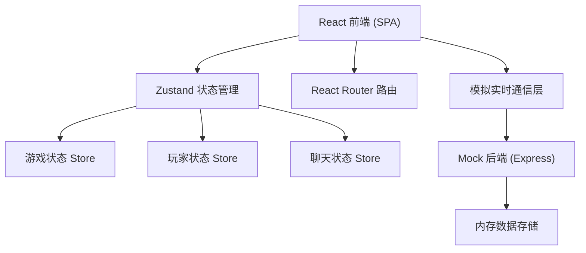
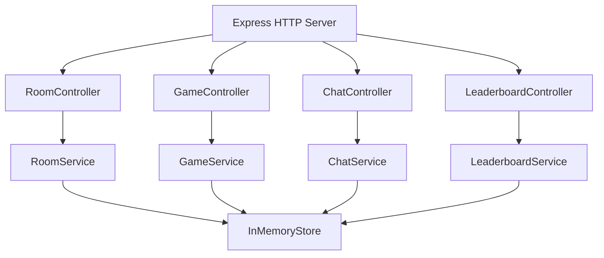
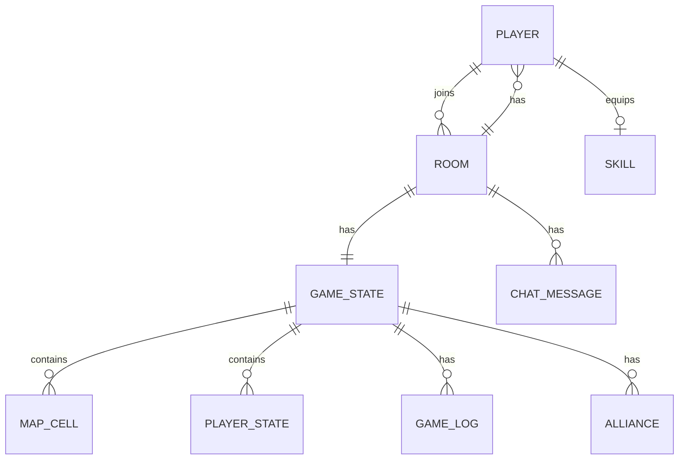

## 1. 架构设计



## 2. 技术选型

- **前端**：React@18 + TypeScript + Vite
- **样式**：TailwindCSS@3 + 自定义 CSS 动画
- **状态管理**：Zustand
- **路由**：React Router DOM@6
- **图标**：lucide-react
- **后端**：Express@4 + TypeScript（Mock 数据，模拟房间和实时通信）
- **数据**：内存存储 + localStorage（断线重连恢复）
- **初始化工具**：vite-init

## 3. 路由定义

| 路由 | 页面组件 | 用途 |
|------|----------|------|
| `/` | Lobby | 大厅页：房间列表、创建/加入房间 |
| `/character` | Character | 角色配置页：外观、技能、称号 |
| `/game/map` | GameMap | 地图页：格子、资源、陷阱展示 |
| `/game/turn` | GameTurn | 回合页：操作面板 |
| `/game/chat` | GameChat | 聊天页：消息、表情、战术 |
| `/game/report` | BattleReport | 战报页：回放、统计 |
| `/leaderboard` | Leaderboard | 排行榜页：排名、引导、重连 |

## 4. API 定义（Mock 后端）

```typescript
// 房间相关
interface Room {
  id: string;
  name: string;
  hostId: string;
  maxPlayers: number;
  currentPlayers: Player[];
  status: 'waiting' | 'playing' | 'ended';
  password?: string;
  createdAt: number;
}

interface Player {
  id: string;
  name: string;
  avatar: string;
  color: string;
  title?: string;
  skill: Skill;
  isReady: boolean;
  isConnected: boolean;
}

interface Skill {
  id: string;
  name: string;
  description: string;
  cooldown: number;
  currentCooldown: number;
  type: 'move' | 'attack' | 'defense' | 'resource';
}

// 地图相关
interface MapCell {
  x: number;
  y: number;
  type: 'normal' | 'resource' | 'trap' | 'base';
  ownerId: string | null;
  resourceAmount: number;
  isTrapActive: boolean;
}

interface GameState {
  roomId: string;
  currentTurn: number;
  currentPlayerId: string;
  map: MapCell[][];
  players: PlayerState[];
  phase: 'roll' | 'move' | 'action' | 'end';
  alliances: Alliance[];
  logs: GameLog[];
}

interface PlayerState {
  playerId: string;
  position: { x: number; y: number };
  resources: number;
  hp: number;
  ownedCells: number;
  skipTurn: boolean;
}

interface Alliance {
  id: string;
  playerIds: [string, string];
  turnLeft: number;
}

interface GameLog {
  id: string;
  turn: number;
  playerId: string;
  action: 'move' | 'occupy' | 'steal' | 'ally' | 'betray' | 'trap' | 'skill';
  data: any;
  timestamp: number;
}

// 聊天相关
interface ChatMessage {
  id: string;
  playerId: string;
  content: string;
  type: 'text' | 'emoji' | 'tactic';
  timestamp: number;
}

// 排行榜相关
interface LeaderboardEntry {
  playerId: string;
  name: string;
  avatar: string;
  wins: number;
  losses: number;
  winRate: number;
  winStreak: number;
  seasonPoints: number;
}
```

## 5. 服务端架构图（Mock）



## 6. 数据模型

### 6.1 ER 图



### 6.2 核心 Store 设计

```typescript
// Zustand stores
// 1. usePlayerStore - 当前玩家信息
// 2. useRoomStore - 房间/匹配状态
// 3. useGameStore - 游戏进行中的状态
// 4. useChatStore - 聊天消息
// 5. useUIGuideStore - 新手引导进度
```
